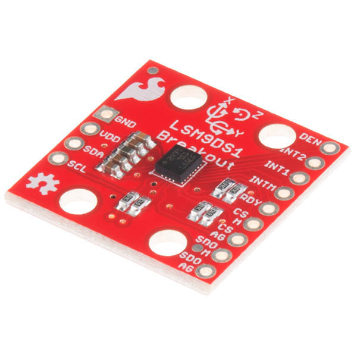

# IMU

The inertial measurement unit used in the embedded system of the bipedal robot is the LSM9DS1 iNEMO system-in-package module developed by STMicroelectronics, this module has the ability to sense a total of 9 degrees of freedom (3-axis accelerometer, 3-axis gyroscope, and 3-axis magnetometer) and includes support for both SPI and I2C for communication. 

