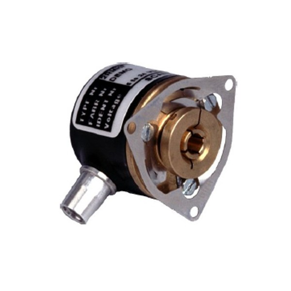

# Motor

The motor used in the embedded system of the robot are the Maxon 14887 DC motor which has the capability to output 150W, the motor is connected to a gearbox which gears the motor 1-to-6. The motor is controlled with the help of an ESCON 70/10 servocontroller. This servocontroller needs a PWM signal as input, where the duty cycle determines the current output of the motor. The servo controller also has input pins for the determination of the output direction of the motor.

Maxon Motor 14887            |   ESCON 70/10 Servocontroller
:-------------------------:|:-------------------------:
  |  

Before the code for the motor is run its important to configure the servo controller with the ESCON studio software. Work done by a prior bachelor thesis group determined that the maximum required amperage for the motor should be 8.3A, this should be configured with the ESCON software including preforming a autotuning.


## Code
The purpose of the code is to control direction of the motors, through two GPIO pins, and to change the trque of the motor, through a PWM pin.

```
void setDutyCycle(int dutyC)
{
  std::ofsteam DCfile;
  DCfile.open("/sys/class/pwm/pwm-" + m_PinpathNumber + "/duty_cycle");
  DCfile << dutyC;
  DCfile.close();
}
```
