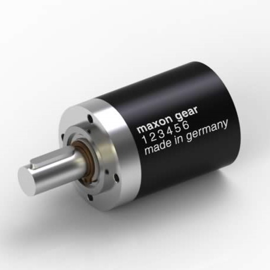

# Motor

The motors are located at the joint between torso and legs. By manipulating the ratio between period and duty-cycle we can decied the current delivered to the motors and by changing the value of the GPIO-pins we can change the directions of the motors. In the robots embeded system this part consists of three parts:

Maxon Motor 14887            |   ESCON 70/10 Servocontroller    |   Gearhead GP42C
:------------------------------------:|:-------------------------------------:|:-------------------------:
  |   | 

NB. The part number written on the motor (402890) is the part number for the particular motor/gearhead combination. We also have a spare with the number 241318. This consists of the same motor, but different gearhead. The spare gearhead has a ratio of 1:26.

The implemented gearheads have ratios of 1:6. 

Before the code for the motor is run its important to configure the servo controller with the ESCON studio software. Work done by a prior bachelor thesis group determined that the maximum required amperage for the motor should be 8.3A, this should be configured with the ESCON software including preforming a autotuning.

## Configure the servo-controller
To configure the ESCON 70/10 Servocontroller you need:
* Escon studio (Software)
* Micro USB
* Power Supply (If you want to Auto tune it)
The config is quite simple. Just start the software and (if connected) a pop up for configuration of ESCON 70/10 will pop up. The pictures under shows what we did step for step.

|||||||||||||||
## Connection and pins

## Code
The purpose of the code is to control direction and torque of both motors. To control the direction you change the "value" of the GPIO-pins and to manipulate the torque you change the "duty_cycle" of the pwm-pins. 

```
void setDutyCycle(int dutyC)
{
  std::ofsteam DCfile;
  DCfile.open("/sys/class/pwm/pwm-" + m_PinpathNumber + "/duty_cycle");
  DCfile << dutyC;
  DCfile.close();
}
```
