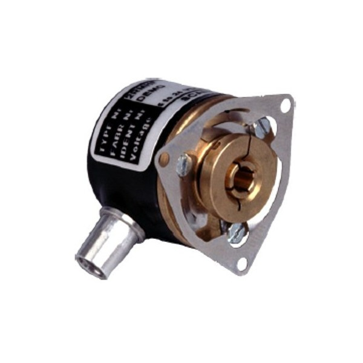

# Encoder

The encoder used in this project is a Scancon 2RMHF industrial encoder that outputs two square wave pulse signals, 3000 times per revolution. To read these signals, the eQEP modules on the Beaglebone are used. The eQEP module reads the two pulses from the encoder and transform this into a number that increases 12000 times per revolution. This number is then stored in memory and is accessible through the interface file “/position” in the “sys/devices/platform/ocp/...” file system.

Encoders on the robot uses separate eQEP pins on the Beaglebone, so each encoder gets its own interface file in their own folder in the /ocp file system
