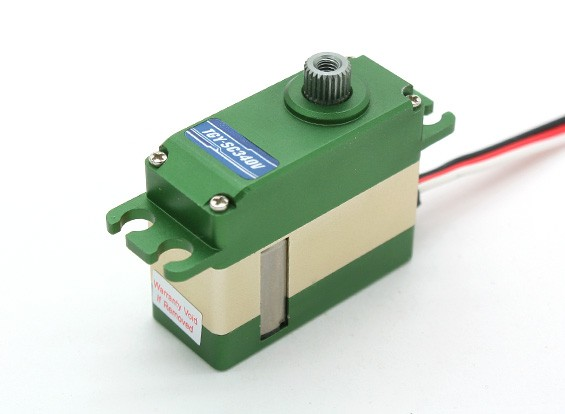

# Servo

As of 2021 four Turnigy TGY-SC340V 6.0-7.4 Volt servos are used to actuate the "toes" at the end of the robot legs. To control the servos two PWM signals is used. Each signal control one set of actuators on each leg. Beaglebone comes with plenty of PWM pins, pin P8 13 and P8 19 were selected to be used for the PWM signals for servo control.

## Servo Code
